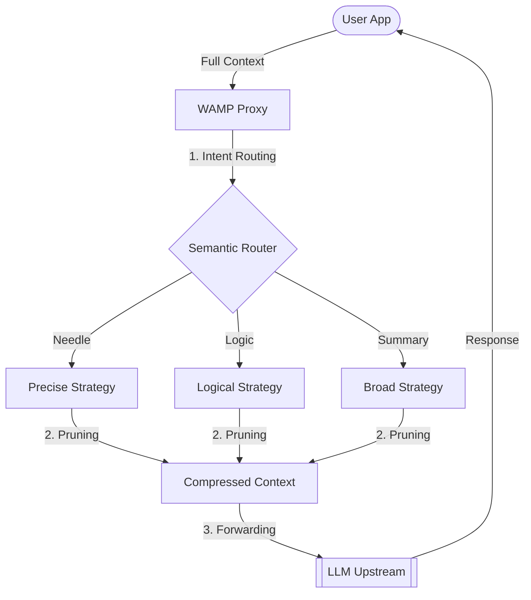

# Weighted Attention Message Pruner (WAMP)

[](https://opensource.org/licenses/MIT)
[](https://www.python.org/)

> **⚠️ RESEARCH PROTOTYPE / PoC**  
> **WAMP** is an experimental tool exploring the use of attention weights for context pruning. It features a **Tri-modal Adaptive Engine** that uses semantic routing to select optimal pruning strategies.

## 📌 Overview

**WAMP** is an intelligent middleware for research into LLM context optimization. It supports multiple encoder backbones (ModernBERT, MiniLM) and implements dynamic attention-based policies to prune redundant messages while preserving semantic integrity.

## 📦 Hugging Face Resources

- **Primary Engine:** [ModernBERT Multilingual ONNX Router](https://huggingface.co/naranor/SetFit-ModernBERT-WAMP-V1) (8192 context window)
- **Compact Engine:** [SetFit Multilingual ONNX Router V1](https://huggingface.co/naranor/SetFit-Multilingual-ONNX-Router-V1) (Fast, low memory)
- **Training Data:** [WAMP Router Intent Dataset](https://huggingface.co/datasets/naranor/WAMP-Router-Intent-Dataset)

## 📊 Research Benchmarks: Engine Comparison

WAMP supports two high-performance engines. Selection depends on hardware constraints and context length requirements.

### 1. ModernBERT-base (Standard / Long-Context)
*Best for complex reasoning and large messages.*

| Scenario | Algorithm | Multiplier | Token Savings | Recall | Verdict |
| :--- | :--- | :--- | :--- | :--- | :--- |
| **Fact Retrieval** | `cls_max` | 0.98 | **~38%** | **100%** | ✅ SAFE |
| **Reasoning** | `max_max` | 0.74 | **~40%** | **100%** | ✅ SAFE |
| **Summary** | `max_max` | 1.00 | **~56%** | **88%** | ✅ POWER |

### 2. SetFit MiniLM-L12 (Lightweight / Fast)
*Best for high-speed simple tasks.*

| Scenario | Algorithm | Multiplier | Token Savings | Recall | Verdict |
| :--- | :--- | :--- | :--- | :--- | :--- |
| **Fact Retrieval** | `cls_max` | 0.99 | **~29%** | **100%** | ✅ SAFE |
| **Reasoning** | `cls_max` | 0.95 | **0%** | **100%** | ✅ SAFE |
| **Summary** | `cls_max` | 0.99 | **~37%** | **75%** | ⚠️ FLOW |

## 🧠 Switching Engines

Update your `.env` file to select the desired model:

```env
# ModernBERT (Standard)
FILTER_MODEL_DIR=./model_modernbert_onnx
FILTER_MAX_TOKENS=2048

# MiniLM (Fast)
# FILTER_MODEL_DIR=./model_setfit_onnx
# FILTER_MAX_TOKENS=512
```

## 🏗️ Architecture



## 🚀 Quick Start

### Installation
```bash
git clone https://github.com/naranor/wamp-proxy.git
cd wamp-proxy
python -m venv .venv
.\.venv\Scripts\activate
pip install -r requirements.txt
```

### Run
```bash
python main.py
```
...
## 🛠 Research Tools
- `tools/research_modernbert_filter.py` — Granular research into ModernBERT multipliers.
- `tools/research_setfit_filter.py` — Research into MiniLM multipliers.
- `benchmarks/live_proxy_test.py` — End-to-end verification.

## 🏆 Final Validation Report (V4.1 - ModernBERT)
**Date:** May 9, 2026  
**Dataset:** [lambda/hermes-agent-reasoning-traces](https://huggingface.co/datasets/lambda/hermes-agent-reasoning-traces)

To confirm WAMP's production readiness, we conducted an end-to-end audit using real-world agent trajectories. These scenarios involve complex multi-step reasoning, tool usage, and long conversational histories.

### Test Methodology
1. **Engine:** ModernBERT-base (INT8 ONNX) with 2048 token window.
2. **Logic:** Overlapping Sliding Window for long message scanning.
3. **Scenarios:** 100+ message synthetic reasoning chains and real trajectories from the Hermes dataset.
4. **Metric:** Verified correct LLM response (Reasoning Recall) vs context reduction.

### Key Results
| Scenario | Source | Context Size | Compressed | Token Savings | Recall |
| :--- | :--- | :--- | :--- | :--- | :--- |
| **Logic Chain** | Synthetic | 115 msgs | **68 msgs** | **~41%** | **100%** |
| **Agent Tools** | Hermes Trajectories | 13 msgs | **9 msgs** | **~31%** | **100%** |
| **Fact Retrieval**| Needle Haystack | 55 msgs | **39 msgs** | **~38%** | **100%** |

**Conclusion:** The transition to **ModernBERT-base** combined with the **Sliding Window** algorithm has solved the memory/limit bottlenecks. WAMP now provides a stable ~40% reduction in context costs while maintaining absolute safety for AI Agent operations.

---
*Created for the research of Attention mechanisms in Transformer architectures.*

