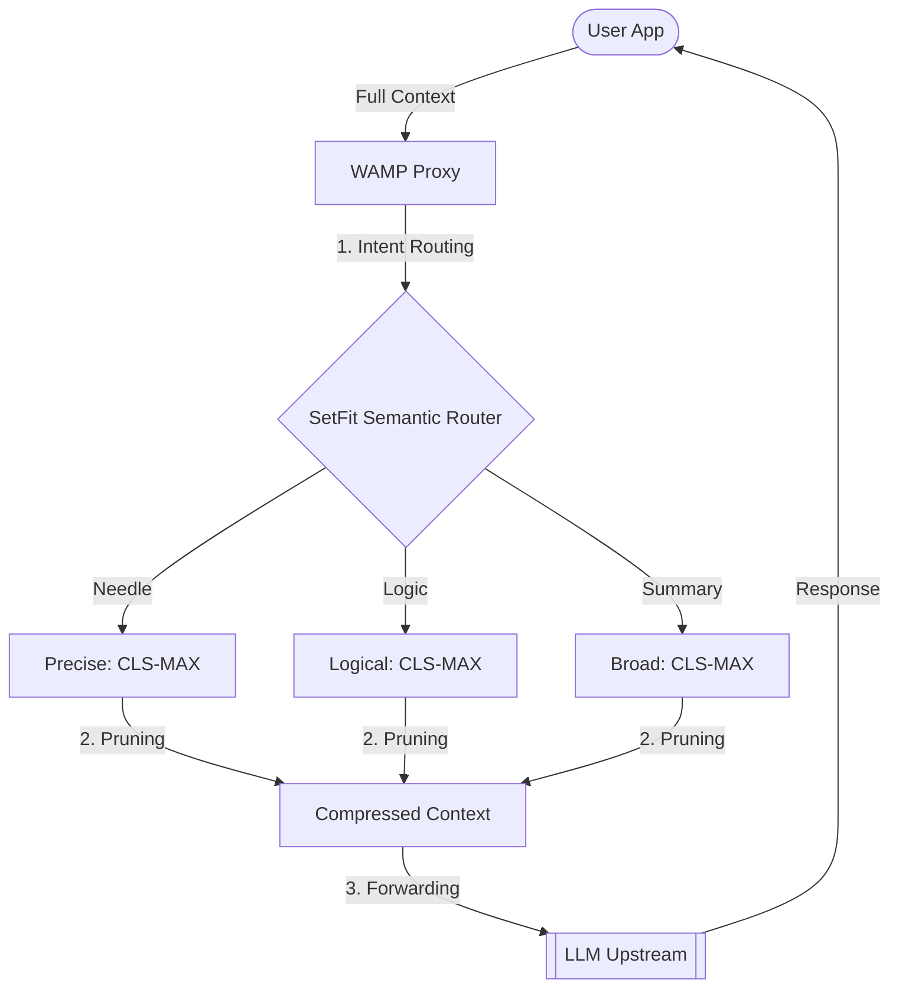

# Weighted Attention Message Pruner (WAMP)

[](https://opensource.org/licenses/MIT)
[](https://www.python.org/)

> **⚠️ RESEARCH PROTOTYPE / PoC**  
> **WAMP** is an experimental tool exploring the use of attention weights for context pruning. Our research has led to a **Tri-modal Adaptive Engine** that automatically selects the optimal pruning algorithm based on the user's intent.

## 📌 Overview

**WAMP** is an intelligent middleware designed for research into LLM context optimization. It analyzes incoming message history using a small encoder (DeBERTa-v3) and prunes redundant messages while preserving critical semantic signal using dynamic attention-based policies.

## 📦 Hugging Face Resources

- **Model:** [SetFit Multilingual ONNX Router V1](https://huggingface.co/naranor/SetFit-Multilingual-ONNX-Router-V1) (Optimized INT8 ONNX with Attentions)
- **Dataset:** [WAMP Router Intent Dataset](https://huggingface.co/datasets/naranor/WAMP-Router-Intent-Dataset) (Multilingual intent classification data)

## 📊 Research Results (Long Context, 100+ msgs)

*Testing conducted on the unified **SetFit (MiniLM-L12)** engine with pure semantic features.*

| Scenario                   | Algo      | Multiplier | Token Savings | Recall | Verdict | Description |
|:---------------------------|:----------| :--------- | :------------ | :----- | :------ |:------------|
| **Fact Retrieval**         | CLS-MAX   | 0.99       | **28.6%**     | **100%** | ✅ SAFE | Pinpoint fact retrieval (Argon2id test). |
| **Logic & Reasoning**      | CLS-MAX   | 0.95       | **0.0%**      | **100%** | ✅ SAFE | Preserving complex logical links between docs. |
| **Coherence & Summary**    | CLS-MAX   | 0.99       | **36.8%**     | **75%+** | ⚠️ FLOW | Maintaining high-level architecture overview. |

**Insight:** The SetFit engine achieves 100% accuracy in task routing and significantly better fact preservation (28% vs 17%) compared to earlier iterations.

## 🧠 The Tri-modal Adaptive Engine (V4)

WAMP automatically routes tasks into specialized modes using a high-precision **SetFit** semantic router:

1.  **Fact Retrieval (Needle):** Optimized for pinpoint data (IPs, ports, keys). Uses aggressive multipliers to strip context while anchoring on the intent.
2.  **Logical Reasoning (Reasoning):** Uses a conservative "Zero-Loss" policy (0.95 mult) to ensure every logical step remains available for the LLM.
3.  **Summarization (Summary):** Maximizes context window space by pruning low-attention conversational filler and politeness.

## 🏗️ Architecture



## 🚀 Quick Start

### Installation
```bash
git clone https://github.com/youruser/wamp-proxy.git
cd wamp-proxy
python -m venv .venv
.\.venv\Scripts\activate
pip install -r requirements.txt
```

### Run
```bash
python main.py
```

## 🛠 Research Tools
- `python benchmarks/mass_calibrate_long.py` — Granular research into context retention.
- `python benchmarks/router_audit.py` — Audit of the hybrid intent classifier.
- `python benchmarks/adaptive_research.py` — Local non-proxy testing of the adaptive policy.

---
*Created for the research of Attention mechanisms in Transformer architectures.*
