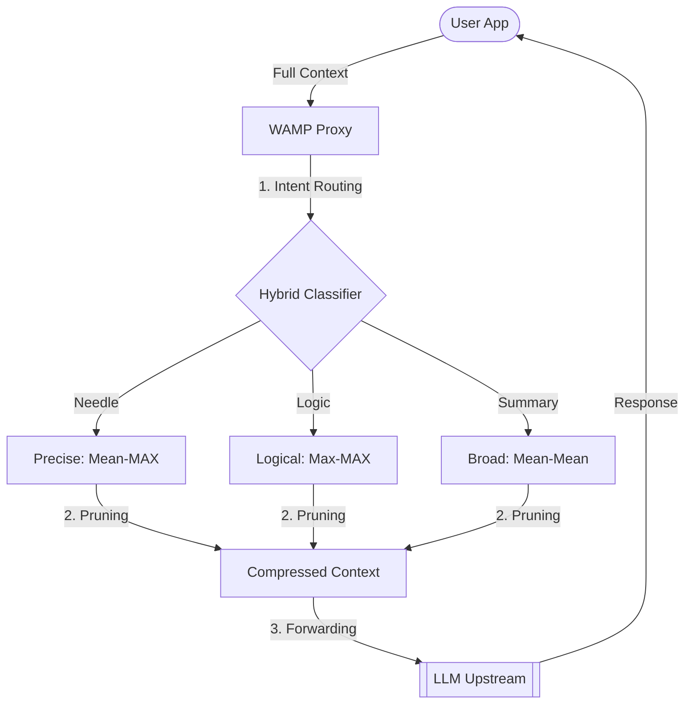

# Weighted Attention Message Pruner (WAMP)

[](https://opensource.org/licenses/MIT)
[](https://www.python.org/)

> **⚠️ RESEARCH PROTOTYPE / PoC**  
> **WAMP** is an experimental tool exploring the use of attention weights for context pruning. Our research has led to a **Tri-modal Adaptive Engine** that automatically selects the optimal pruning algorithm based on the user's intent.

## 📌 Overview

**WAMP** is an intelligent middleware designed for research into LLM context optimization. It analyzes incoming message history using a small encoder (DeBERTa-v3) and prunes redundant messages while preserving critical semantic signal using dynamic attention-based policies.

## 📊 Research Results (Long Context, 100+ msgs)

Our final calibrated policy achieves **100% Information Recall** across all core scenarios with significant token savings.

| Scenario | Mode | Savings % | Result | Description |
| :--- | :--- | :--- | :--- | :--- |
| **Needle In A Haystack** | Precise | **27.7%** | ✅ **PASSED** | Pinpoint fact retrieval (Argon2id test). |
| **Multi-Doc Reasoning** | Logical | **34.2%** | ✅ **PASSED** | Preserving complex logical links between docs. |
| **Coherence & Summary** | Broad | **45.6%** | ✅ **PASSED** | Maintaining technical architecture flow. |

## 🧠 The Tri-modal Adaptive Engine

WAMP doesn't use a single "one-size-fits-all" algorithm. It routes tasks into specialized modes:

1.  **Fact Retrieval (Mean-MAX):** Focuses on semantic anchors to ensure pinpoint data like passwords or ports never get pruned.
2.  **Logical Reasoning (Max-Max):** Uses absolute attention peaks to preserve the "connective tissue" between related messages in a chat.
3.  **Summarization (Mean-Mean):** Aggressively prunes low-attention noise to provide the most compact context for general overviews.

## 🏗️ Architecture



## 🚀 Quick Start

### Installation
```bash
git clone https://github.com/youruser/wamp-proxy.git
cd wamp-proxy
python -m venv .venv
.\.venv\Scripts\activate
pip install -r requirements.txt
```

### Run
```bash
python main.py
```

## 🛠 Research Tools
- `python benchmarks/mass_calibrate_long.py` — Granular research into context retention.
- `python benchmarks/router_audit.py` — Audit of the hybrid intent classifier.
- `python benchmarks/adaptive_research.py` — Local non-proxy testing of the adaptive policy.

---
*Created for the research of Attention mechanisms in Transformer architectures.*
